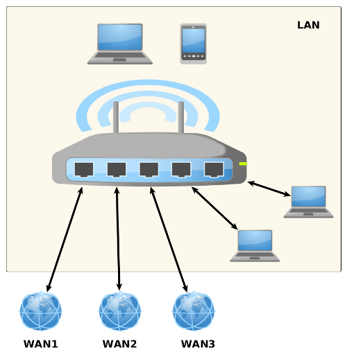
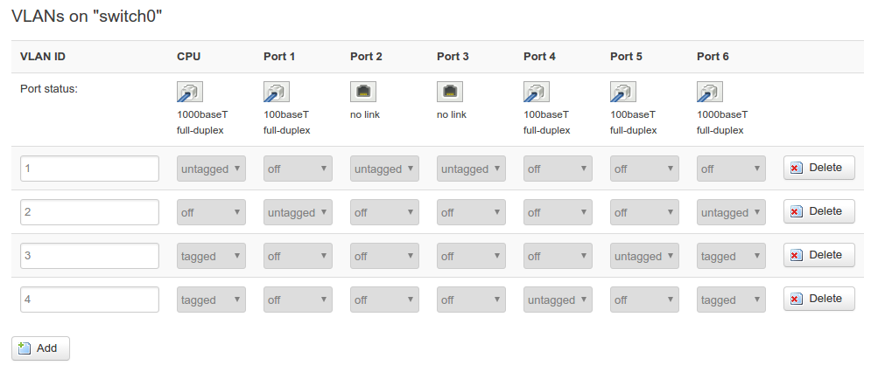
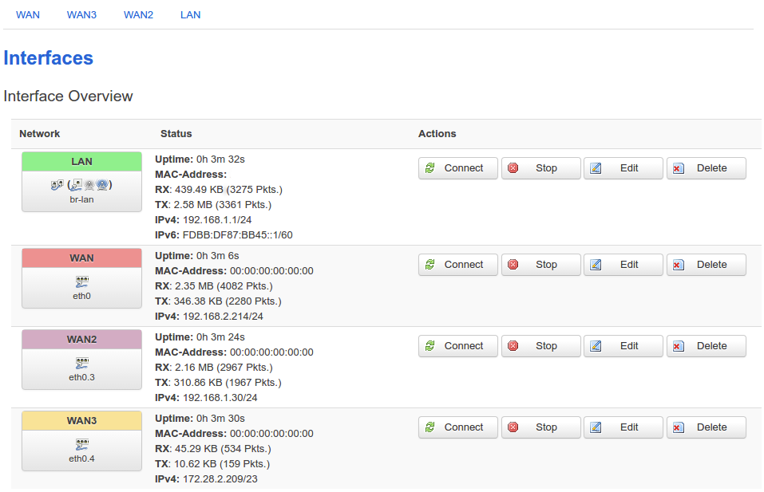
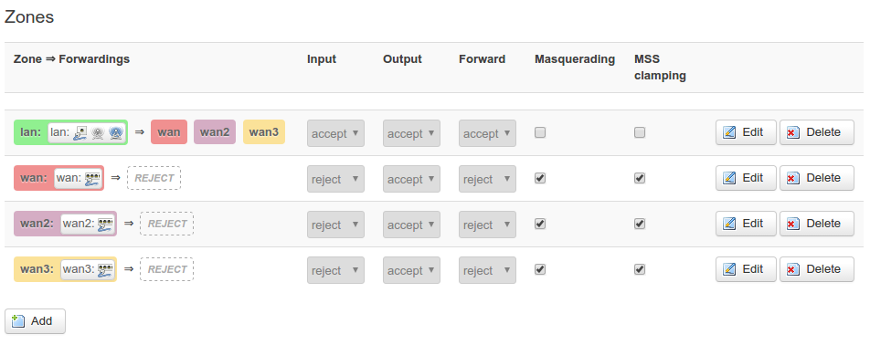
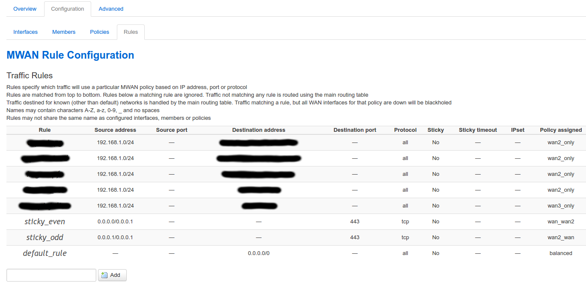
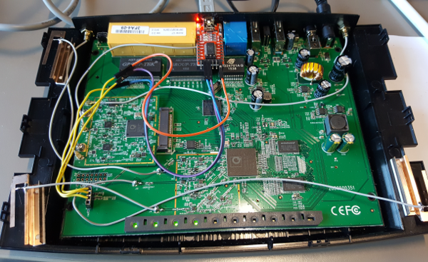

# OpenWrt mutli-wan configuration

An example of an OpenWrt powered multi wan working configuration on a TP-Link Archer C7 v2 router

## Architecture



## mwan3

mwan3 is an OpenWrt module providing load balancing, fail over, easy configuration of all your WANs : https://wiki.openwrt.org/doc/howto/mwan3

## Installation

* make sure your router is present in OpenWrt table of hardware : https://wiki.openwrt.org/toh/start

* install OpenWrt on your router following guide (for TP-Link Archer C7 : https://wiki.openwrt.org/toh/tp-link/tl-wdr7500)

* access OpenWrt configuration interface via 192.168.1.1 on local network or serial connection if you can. Serial connection is useful if you mess up with your default local network config and cant access anymore OpenWrt interface. I followed Dave Boechler experiment to get it working : http://vtechdesign.com/archerc7mod.html (see Annex section)

* install mwan3 package from System->Software

## Setup your configuration

### Switch config

In Network->Switch edit your switch configuration :

* remove ports from VLAN1 which will be used for your WAN
* add one VLAN per WAN you want to configure
* leave the CPU `tagged` and untag your WAN port for each WAN  

In my case, below, I have WAN on port 1 in VLAN2 (default), WAN2 on port 5 in VLAN3, WAN3 on port 4 in VLAN4



### Interfaces config

In Network->Interfaces create your WAN interfaces :

* choose `DHCP Client` protocol in General Setup 
* in VLAN settings choose your previously created VLAN that match this WAN
* in firewall settings select your WAN interface
* in Advanced settings, choose a different metric for all your WAN beginning with 10 for WAN, 20 for WAN2, 30 for WAN3 etc... (check https://wiki.openwrt.org/doc/howto/mwan3)



### Firewall config

In Network->Firewall edit for each of your new WAN networks :

* input : `REJECT`; output : `ACCEPT` ; forward : `REJECT`
* enable masquerading & MSS Clampling



### Enable & Start

* edit you mwan3 configuration file located in `/etc/config/mwan3`, check configuration for each wan interface you have created on the web interface. Check that `option enabled '1'` is present for each WAN interface

For instance : 
```
config interface 'wan'
	option enabled '1'
	list track_ip '8.8.8.8'
	list track_ip '8.8.4.4'
	option reliability '1'
	option count '1'
	option timeout '2'
	option interval '5'
	option down '3'
	option up '8'

config interface 'wan2'
	option enabled '1'
	list track_ip '8.8.8.8'
	list track_ip '8.8.4.4'
	option count '1'
	option timeout '2'
	option interval '5'
	option down '3'
	option up '8'
	option reliability '2'

config interface 'wan3'
	option enabled '1'
	list track_ip '8.8.8.8'
	list track_ip '8.8.4.4'
	option count '1'
	option timeout '2'
	option interval '5'
	option down '3'
	option up '8'
	option reliability '3'
```

* check that you can ping all your WAN interfaces correctly using : 

check WAN, WAN1 & WAN2 :  
```
ping -I eth0 google.fr
ping -I eth0.3 google.fr
ping -I eth0.4 google.fr
```

* start mwan3

```
mwan3 start
```

* check mwan3 status :

```
root@OpenWrt:~# mwan3 status
Interface status:
Interface wan is online (tracking active)
Interface wan2 is online (tracking active)
Interface wan3 is online (tracking active)
```

If one or several of your wan interfaces are `offline`, check Troubleshoot section

### Setup rules

* You can build your own rules in Network->Load Balancing->Configuration->Rules. In this repository default mwan3 config has policy balanced which balance 60% on WAN & 40% on WAN2. These values can be changed using different `metric`/`weight` for the members in your mwan3 configuration file composing a network policy.

For instance, default `balanced` policy is : 

```
config policy 'balanced'
	list use_member 'wan_m1_w3'
	list use_member 'wan2_m1_w2'
```

The following members are involved in `balanced` policy : 

```
config member 'wan_m1_w3'
	option interface 'wan'
	option metric '1'
	option weight '3'

config member 'wan2_m1_w2'
	option interface 'wan2'
	option metric '1'
	option weight '2'
```

The same metric is used for both `wan` & `wan2` but they have different weight which feature load balancing values

* rules like `wan_only`, `wan2_only`, `wan3_only` have only one member refering to one WAN interface



## Troubleshoot

### common error : `Interface wanX is offline`

* if you have followed everything above, check https://wiki.openwrt.org/doc/howto/mwan3 to be sure nothing is left behind

* edit your `list track_ip` lines in your mwan3 config to give network DNS IP to be tracked instead. This DNS IP can be retrieved using following command when you plug your WAN to your personal computer : 

```
nmcli device show eth0
```
add a `list track_ip` line for each DNS server for each interface & see if that solves your problem

### mwan3 rule is not working

* mwan3 rules name have a max length of 15, check that your rule name is not too long

* mwan3 rules are sorted and sort order matters. Reorder your rules to your need.

* the best way to check if you have made a mistake writing your rule or if this has something to do with your configuration (sort order) is to `traceroute` the IP/Domain targetted by your rule :

```
# traceroute google.fr
traceroute to google.fr (64.15.116.155), 30 hops max, 60 byte packets
 1  192.168.0.254 (192.168.0.254)  0.706 ms  3.134 ms  3.602 ms         <==== check the gateway used
 ...
 ...
 ...
```

## Annex

* Serial configuration (115200 8 1):



## Note

You can also use a Wifi interface (2.4 or 5) as WAN, not necessaraly ethernet interface
